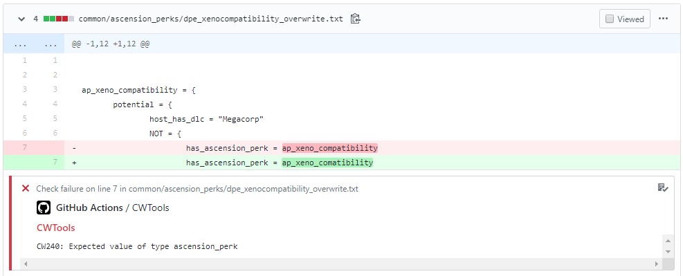
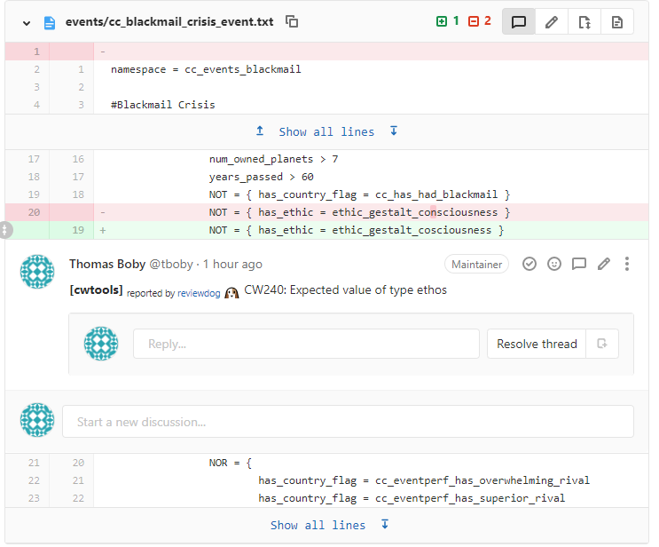

# CWTools Action

Run CWTools on your Clausewitz mod PDXScript code in parallel to your builds.

If CWTools finds errors, warnings or suggestions in the mod code then they will be output.

It will also insert them as inline feedback into your PRs ("Files changed" tab):



## Setup

**GitHub:** Can't use GitHub? Click [here](#gitlab) for GitLab installation instructions .

In most cases, no setup is required beyond adding the following workflow yml file to your project (`.github/workflows` folder) and setting the correct game. See below for advanced configuration and an explanation of the tools used.

The following games require no further setup:

- HOI4
- Stellaris

### Example workflow yml

```yml
name: CWTools CI

on: [pull_request, push] # other events may work but are not supported

jobs:
  cwtools_job:
    runs-on: ubuntu-latest
    steps:
    - uses: actions/checkout@v1 # required
    - uses: cwtools/cwtools-action@v1.0.0
      with:
        game: hoi4
      env:
        GITHUB_TOKEN: ${{ secrets.GITHUB_TOKEN }} # required, secret is automatically set by github

```

This action will create a new job called "CWTools", which will be used to annotate your code. Its success or failure state depends on the CWTools output.

The full `output.json` log is saved to `$GITHUB_WORKSPACE`, and can be recovered with [actions/upload-artifact](https://github.com/actions/upload-artifact).

```yml
    - uses: cwtools/cwtools-action@v1.0.0
      with:
        game: hoi4
      env:
        GITHUB_TOKEN: ${{ secrets.GITHUB_TOKEN }}
    - name: Upload artifact
      if: always() # so even if the check fails, the log is uploaded
      uses: actions/upload-artifact@v1.0.0
      with:
        name: cwtools_output
        path: output.json
```

## Configuration

### game (required)

What game to use. Allowed values: `hoi4`, `ck2`, `eu4`, `ir`, `stellaris`, `vic2`.

```yml
    - uses: cwtools/cwtools-action@v1.0.0
      with:
        game: hoi4
      env:
        GITHUB_TOKEN: ${{ secrets.GITHUB_TOKEN }}
```

### modPath (optional)

Path to the mod folder in `$GITHUB_WORKSPACE` (root of repository). (Default: "" - root of repository itself)

```yml
    - uses: cwtools/cwtools-action@v1.0.0
      with:
        game: hoi4
        modPath: "mod_folder"
      env:
        GITHUB_TOKEN: ${{ secrets.GITHUB_TOKEN }}
```

### cache (optional)

Path to the full cache file (`cwb.bz2`) in `$GITHUB_WORKSPACE` (root of repository). Use an empty string to use metadata from cwtools/cwtools-cache-files (Default: use metadata)

```yml
    - uses: cwtools/cwtools-action@v1.0.0
      with:
        game: hoi4
        cache: "cache/hoi4.cwb.bz2"
      env:
        GITHUB_TOKEN: ${{ secrets.GITHUB_TOKEN }}
```

### locLanguages (optional)

Which languages to check localisation for, space separated, lowercase (eg. `english spanish russian`). Note: May be different from game to game. (Default: `english`)

```yml
    - uses: cwtools/cwtools-action@v1.0.0
      with:
        game: hoi4
        locLanguages: "english spanish russian"
      env:
        GITHUB_TOKEN: ${{ secrets.GITHUB_TOKEN }}
```

### vanillaMode (optional)

Whether to not use cache, and instead treat the project as a vanilla game installation folder - if you are a modder, you probably should not be using this. If True, cache input will be ignored (Default: False, set to anything other than 0 or blank for True)

```yml
    - uses: cwtools/cwtools-action@v1.0.0
      with:
        game: hoi4
        vanillaMode: "1"
      env:
        GITHUB_TOKEN: ${{ secrets.GITHUB_TOKEN }}
```

### rules (optional)

What rules repository to use (Default: `https://github.com/cwtools/cwtools-$INPUT_GAME-config.git`)

```yml
    - uses: cwtools/cwtools-action@v1.0.0
      with:
        game: hoi4
        rules: "https://github.com/Yard1/cwtools-hoi4-config.git"
      env:
        GITHUB_TOKEN: ${{ secrets.GITHUB_TOKEN }}
```

### rulesRef (optional)

What ref on rules repo to checkout (Default: `master`)

```yml
    - uses: cwtools/cwtools-action@v1.0.0
      with:
        game: hoi4
        rulesRef: "1.0.0"
      env:
        GITHUB_TOKEN: ${{ secrets.GITHUB_TOKEN }}
```

### changedFilesOnly (optional)

By default will only annotate changed files in a push or a pull request. In order to annotate all files set `changedFilesOnly` input to `"0"`.

```yml
    - uses: cwtools/cwtools-action@v1.0.0
      with:
        game: hoi4
        changedFilesOnly: "0"
      env:
        GITHUB_TOKEN: ${{ secrets.GITHUB_TOKEN }}
```

### suppressedOffenceCategories (optional)

You can choose to suppress annotations with chosen CWTools offence category IDs (`CW###`) per GitHub severity type (failure, warning, notice).

```yml
    - uses: cwtools/cwtools-action@v1.0.0
      with:
        game: hoi4
        suppressedOffenceCategories: '{"failure":["CW110", "CW210"], "warning":[], "notice":[]}' # will suppress CW110 and CW210 category failures, but will show those for warnings and notices
      env:
        default: ${{ secrets.GITHUB_TOKEN }}
```

### suppressedFiles (optional)

You can choose to suppress annotations completely in certain files. Use paths from root of repository, make sure to have no trailing whitespace. Globbing is not supported.

```yml
    - uses: cwtools/cwtools-action@v1.0.0
      with:
        game: hoi4
        suppressedFiles: '["common/scripted_effects/my_effects.txt", "events/EventFile.txt"]' # will completely suppress any annotations in those two files
      env:
        default: ${{ secrets.GITHUB_TOKEN }}
```

### CWToolsCLIVersion (optional)

Which CWTools.CLI version to use (Default: latest stable).

```yml
    - uses: cwtools/cwtools-action@v1.0.0
      with:
        game: hoi4
        CWToolsCLIVersion: '0.0.7'
      env:
        default: ${{ secrets.GITHUB_TOKEN }}
```

## GitLab

**Due to limitations with GitLab, this currently only works for merge requests to master**

[](gitlab)Running this action on GitLab is a bit more involved, requiring the creation of a bot account. It is also limited to providing comments on pull requests as shown here:



### Setting up the bot account

1. Create a new GitLab account for this "bot" and give it "Reporter" access to your project.
2. Log into the account, browse to [the Personal Access Token page](https://gitlab.com/profile/personal_access_tokens) and generate a PAT with "api" scope. Make a note of the token.
3. Log back into your primary account.
4. Browse to your Project and go to "Settings", "CI / CD", and open the section "Variables".
5. Create a variable called "REVIEWDOG_GITLAB_API_TOKEN". Put the PAT generated above as the Value, then set it as "Masked" but **not** Protected.
6. Press "Save variables".

**Please note:** This PAT gives access to all projects the bot can access. If somebody gets access to your pipeline logs, it's possible (although not likely) that they could access the token.

### Configuring gitlab-ci

1. In the root of your project create a file called `.gitlab-ci.yml`
2. Copy the contents of the example file [GitLab_CWToolsCI.yml](examples/GitLab_CWToolsCI.yml), found in /examples, into it.
3. Configure the variables if desired (see above).
4. Create a merge request and check it works!

#### GitLab self-hosted

If you're running your own instance of GitLab, you'll need to set the following two variables in addition to those in the default template:

```
 - GITLAB_API: "https://example.gitlab.com/api/v4"
 - REVIEWDOG_INSECURE_SKIP_VERIFY: true
```

## How this works

[CWTools](https://github.com/tboby/cwtools) is a .NET library that provides features to analyse and manipulate the scripting language used in Paradox Development Studio's games (PDXScript). This is mainly used in a VS Code extension, [cwtools-vscode](https://marketplace.visualstudio.com/items?itemName=tboby.cwtools-vscode). CWTools also provides a CLI tool [CWTools.CLI](https://www.nuget.org/packages/CWTools.CLI/) to allow automated anaylsis, which is what this action relies on.

This action relies on two things:

1. A set of valiation rules written for the game your mod is for
2. A cache file containing key information from vanilla files

### Validation rules

The validation rules are taken from the master branch of the public repository for the game, e.g. [https://github.com/cwtools/cwtools-hoi4-config](https://github.com/cwtools/cwtools-hoi4-config). The settings `rules` and `rulesRef` can be used to specify an alternative repo, or to stay on an old version of the rules.

### Vanilla cache file

In order to validate correctly, CWTools requires certain data from the vanilla game files such as defined localisation, variables, etc. There are two formats of cache file:

#### Metadata only

The metadata format contains a limited set of information from vanilla, enough to run the main validator. For convenience CWTools automatically generates these metadata cache files for the latest public rules and latest version of each game. These are found [here](https://github.com/cwtools/cwtools-cache-files) and are used by default in this action (please note that not all games may be supported yet).

#### Full

The full format contains a more details, processed, version of the vanilla script files. This is required in order to provide accurate validation taking load order and file overrides into account. This is the same format used by cwtools-vscode. We do not provide these files, however this action can be configured to use them.

## Credits

Created by Antoni Baum ([Yard1](https://github.com/Yard1)).

Using [tboby/cwtools](https://github.com/tboby/cwtools).

Based on [gimenete/rubocop-action](https://github.com/gimenete/rubocop-action) by Alberto Gimeno.
